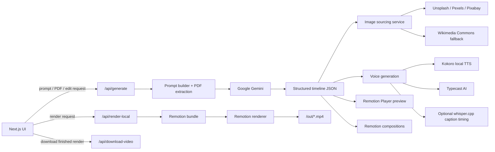

# Remotion Video Creation

Generate educational explainers and quiz videos with **Next.js**, **Remotion**, AI-assisted timeline generation, dynamic image sourcing, and both local and cloud voice pipelines.

This project is designed as an end-to-end video creation workspace:
- generate a timeline from a prompt or uploaded PDF
- preview the composition immediately in the browser
- edit the timeline with follow-up instructions
- render the final MP4 locally

## What It Does

The app currently supports:
- Education videos
- Kids education videos
- Dual-answer quiz videos in landscape or portrait
- Single-question quiz videos
- Voice generation with Kokoro TTS or Typecast AI
- Image sourcing with fallback providers
- Local Remotion rendering through the app UI

## Stack

- Next.js App Router
- Remotion
- React 19
- Tailwind CSS v4
- Google Gemini for timeline generation
- Kokoro TTS for local voice generation
- Typecast AI for hosted premium voices
- Wikimedia / Unsplash / Pexels / Pixabay for imagery
- Vitest + ESLint
- Docker / Docker Compose

## Quick Start

### Prerequisites

- Node.js 20+
- npm 10+
- Docker + Docker Compose

Docker is the easiest way to run this project consistently, especially if you want Remotion and native dependencies to behave the same across machines.

### Environment Variables

Copy the template:

```bash
cp .env.local.example .env.local
```

Core variables:

- `GOOGLE_GENERATIVE_AI_API_KEY`: required for timeline generation and edit flows
- `TYPECAST_API_KEY`: optional, enables Typecast voices
- `TYPECAST_API_KEY2`: optional fallback Typecast key
- `UNSPLASH_ACCESS_KEY`: optional image source
- `PEXELS_API_KEY`: optional image source
- `PIXABAY_API_KEY`: optional image source
- `HF_TOKEN`: optional if your local model flow needs Hugging Face auth

Notes:
- With no stock image keys configured, the app can still fall back to Wikimedia Commons for images.
- If Typecast keys are absent, use Kokoro voices.
- Timeline generation will not work without `GOOGLE_GENERATIVE_AI_API_KEY`.

## Running With Docker

Build and start the app:

```bash
docker compose up -d --build
```

Then open:

- App: [http://localhost:3000](http://localhost:3000)

Useful Docker commands:

```bash
docker compose logs -f app
docker compose exec app npm run lint
docker compose exec app npm run test
docker compose down
```

The compose setup mounts:
- `public/audio` for generated and preview audio assets
- `out` for rendered MP4 output

## Running Without Docker

Install dependencies and start development:

```bash
npm install
npm run dev
```

Optional commands:

```bash
npm run remotion
npm run lint
npm run test
npm run build
```

## System Architecture



### Request Flow

1. The user enters a prompt or uploads a PDF in the Next.js UI.
2. [`/api/generate`](./src/app/api/generate/route.ts) builds a generation prompt, optionally extracts PDF content, and requests timeline JSON from Gemini.
3. The timeline is enriched with background imagery and narration audio.
4. The browser previews the result using the Remotion Player.
5. When the user exports, [`/api/render-local`](./src/app/api/render-local/route.ts) bundles the Remotion project and renders an MP4 into `/out`.

### Main Application Modules

- [`src/app/page.tsx`](./src/app/page.tsx): main product UI for prompt input, preview, editing, and export
- [`src/app/api/generate/route.ts`](./src/app/api/generate/route.ts): timeline generation and edit API
- [`src/app/api/render-local/route.ts`](./src/app/api/render-local/route.ts): local render orchestration and progress tracking
- [`src/lib/prompt/prompt-builder.ts`](./src/lib/prompt/prompt-builder.ts): request normalization for prompt, PDF, and edit flows
- [`src/lib/image/unsplash.ts`](./src/lib/image/unsplash.ts): image provider cascade and fallback selection
- [`src/lib/tts/kokoro-tts.ts`](./src/lib/tts/kokoro-tts.ts): local voice generation
- [`src/lib/tts/typecastAi-tts.ts`](./src/lib/tts/typecastAi-tts.ts): Typecast voice generation
- [`src/remotion/Root.tsx`](./src/remotion/Root.tsx): composition registration

## Project Structure

```text
src/
  app/                 Next.js routes, UI, and API endpoints
  components/          Shared UI controls
  helpers/             Rendering state helpers
  lib/                 Prompting, TTS, image sourcing, PDF extraction
  remotion/            Compositions, templates, and Remotion entrypoints
types/                 Timeline and request schemas
public/                Static assets and preview audio
scripts/               Utility scripts
out/                   Rendered videos written at runtime
```

## Repository Hygiene

This repo now treats generated media as runtime output rather than source:
- rendered demo MP4s should stay out of version control
- generated timeline audio should stay out of version control
- only reusable preview assets and sound effects should live under `public/`

If you plan to make the repository fully public, also consider rewriting Git history before pushing, because older commits may still contain large generated binaries even after the working tree is cleaned up.

## Available Scripts

| Command | Description |
| :--- | :--- |
| `npm run dev` | Start the Next.js development server |
| `npm run build` | Build the production app |
| `npm run start` | Start the production server |
| `npm run lint` | Run ESLint |
| `npm run test` | Run Vitest in CI mode |
| `npm run test:watch` | Run Vitest in watch mode |
| `npm run remotion` | Open Remotion Studio |
| `npm run render` | Render via Remotion CLI |
| `npm run deploy` | Run the deployment helper script |

## Publishing Notes

Before opening the repo publicly, make sure to:
- add real screenshots or a short demo GIF to the README
- verify `.env.local` is not committed
- confirm API keys are rotated if they were ever used in local samples
- decide whether the Remotion Lambda deployment path should stay documented or be simplified for contributors

## License

No license file is included yet. Add one before broad public reuse if you want others to be able to fork, modify, or redistribute the project under clear terms.
